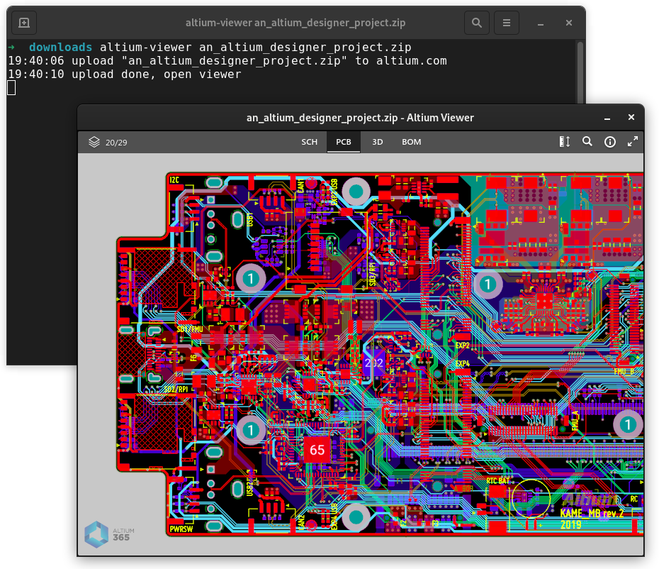

# altium-viewer

[Altium](https://www.altium.com/) provides a nice [web-based tool](https://www.altium.com/viewer/) to visualize PCB
designs. Because manually uploading the project files trough the web interface can become a bit cumbersome, I created
this little command line-tool which takes care of uploading the project to Altium servers and opening it in its own
desktop window.



## Installation

You will need to install [Go](https://golang.org/) first.

```
go get -u github.com/jmichiels/altium-viewer/cmd/altium-viewer
```

## Usage

```
altium-viewer an_altium_designer_project.zip
```